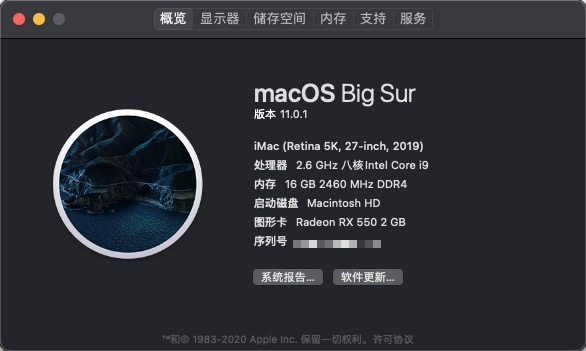

# 华硕Z170-AR 黑苹果Opencore
本EFI可在macOS Big Sur (11.0.1)上驱动。FCPX显卡渲染正常工作。HDR可正常开启。支持睡眠，隔空投送和接力。

Big Sur需要OpenCore 0.6.3，系统更新前请先更新EFI。

## 注意事项
1. 在Clover和OpenCore之间切换时请清除NVRAM。
2. 强烈建议使用Xcode或其他plist编辑器。不推荐使用OpenCore Configurator，原因是每次OpenCore更新文件结构都在改变。
3. 如果你没有独立显卡（核显输出），参考[这里](https://dortania.github.io/OpenCore-Desktop-Guide/config.plist/skylake.html#add_1)修改`/EFI/OC/config.plist` -> `DeviceProperties/Add/PciRoot(0x0)/Pci(0x2,0x0)`。
4. OpenCanopy和HiDPI默认开启。如果你没有4K显示器，请修改`/EFI/OC/config.plist` -> `NVRAM/Add/4D1EDE05-38C7-4A6A-9CC6-4BCCA8B38C14/UIScale`。
5. 为了保证兼容性，使用六代和七代处理器的，请使用EFI-67th，八代和九代处理器的使用EFI-89th。

## 硬件
| 类别 | 品牌 | 型号 | 驱动 | 备注 |
|-----|-----|-----|-----|-----|
| 主板 | 华硕 | Z170-AR | | |
| 处理器 | 英特尔 | i9-9900k（我用的是es版本的） |  | |
| 内存 |  | 16GB DDR4 2666 |  |  |
| 核芯显卡 | 英特尔 | UHD630 | 免驱 | Headless模式 |
| 独立显卡 |  | RX 580 | 免驱 | 2304流处理器 |

## BIOS设置
| 名称 | 选项 |
| --- | --- |
| SW Guard Extensions (SGX) | 关闭 |
| CFG Lock | 关闭 |
| VT-d | 关闭 |
| 大于4G地址空间解码 | 开启 |
| 首选显卡 | PCIE |
| 初始化iGPU | 开启 |
| DVMT Pre-Allocated | 128M |
| IOAPIC 24-119 Entries | 关闭 |
| 网络堆栈 | 关闭 |
| Legacy USB 支持| 开启 |
| 快速启动 | 关闭 |
| 操作系统类型 | 其他操作系统 |
| 开启CSM | 关闭 |

## 魔改BIOS

如果你想你的Z170-AR支持6代到9代的处理器，可以参考下面的帖子刷对应的BIOS（刷之前请确保你有编程器，而且懂得如何救砖）

http://www.smxdiy.com/thread-1407-1-1.html

## 感谢

该项目参考：https://github.com/BrushXue/Z170i-Pro-Gaming-OpenCore

BIOS来自SMXDIY论坛的dsanke大神：http://www.smxdiy.com/thread-1407-1-1.html

在此表示感谢！